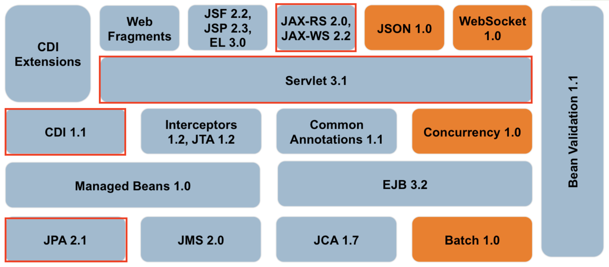

# Komponentenbasierte Entwicklung
#### Probleme beim Softwareprojekten:

* Standardaufgaben wiederholt programmieren,
* z.B.: Userdaten lesen, validieren, und in Datenobjekte kopieren
* Daten aus XML parsen und in Datenobjekte kopieren
* Datenobjekte in DB persistieren

#### Grundgedanke bei KBE:

* Unterteilung von Anwendungen in wiederverwendbare Komponenten
* Möglichst wenig Code neu programmieren zu müssen
* Anwendungen nach dem Baukastenprinzip zusammensetzen

#### Lösung für diese Probleme sind Frameworks

* Standardlösung für ein großenteils der Probleme die uns im Alltag begegenen
* Spezifikation (Specs) definieren Lösung für wiederkehrende Probleme
	* schnellere Entwicklung dadurch möglich

##### Beispiel Backend-System

**Neuhergestellte Sportuhren sollen zentral registriert werden dazu gibt es ein zentrales Backend-System**
* **Problem:** Daten aus XML in Datenobjekte überführen
	* Parser selbst schreiben um Daten zu valideren zu können?
	* **Besser:** Framework nutzen! -> JAXB Framework (JAXB = Java Architecture for XML Binding)
* **Problem:** Datenobjekte in DB persistieren
	* Mit JDBC selbst programmieren?
	* **Besser:** Framework nutzen! -> Hibernates nutzen o.a.

* **JAXB und JPA sind Bestandteile von Java Platform Enterprise Edition (Java EE)**

> Java EE Definition: Spezifikation einer Softwarearchitektur für die transaktionsbasierte Ausführung von in Java programmierten Anwendungen.  

##### Application Servern Bestandteile:

* Management der Komponenten über den gesamten Lebenszyklus (inklusive Instanziierung)
* Kommunikation zwischen JavaEE-Komponenten
* Namens- und Verzeichnisdienste
* Sessionmanagement
* Persistenzdienste zum langfristigen Speichern von Java-Objekten
* Transaktionsmanagement
* Unterstützung für die Installation (Deployment)

#### Framework Definition

> Ein Framework ist eine semi-vollständige Applikation. Es stellt für Applikationen eine   
> wiederverwendbare, gemeinsame Struktur zur Verfügung. — Ralph E. Johnson, Brian Foote (1988)  

Arbeitet meist nach dem _Hollywood Princable: „Don’t call us, we will call you.“_
#### Plan an Frameworks für das Semester 

* Maven, JUnit
* OOP: Reflexion (Refleciton) und Annotationen
* Komponenten, Komponentenmodell
* Servlets, MVC, HTTP
* RESTful Webservices
* Dependency Injection
* Java Persistence API (JPA)
* Ziel der Übungen: Professioneller Java-Code

#kbe